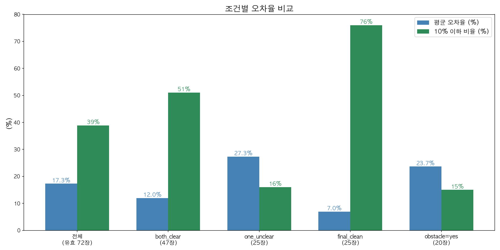
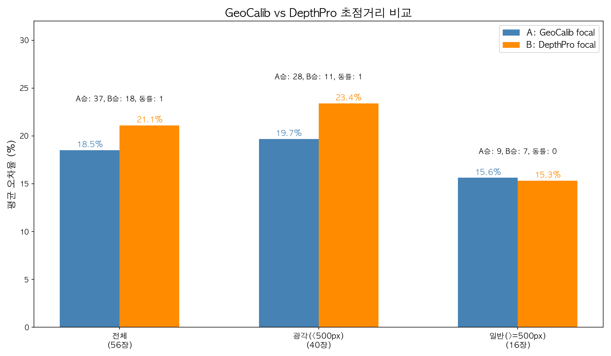
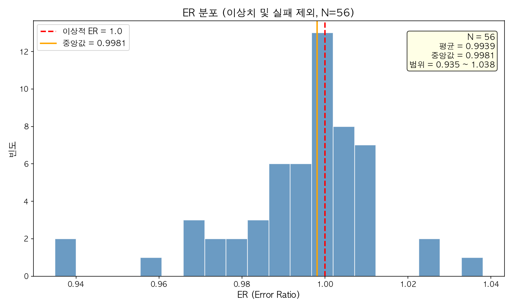
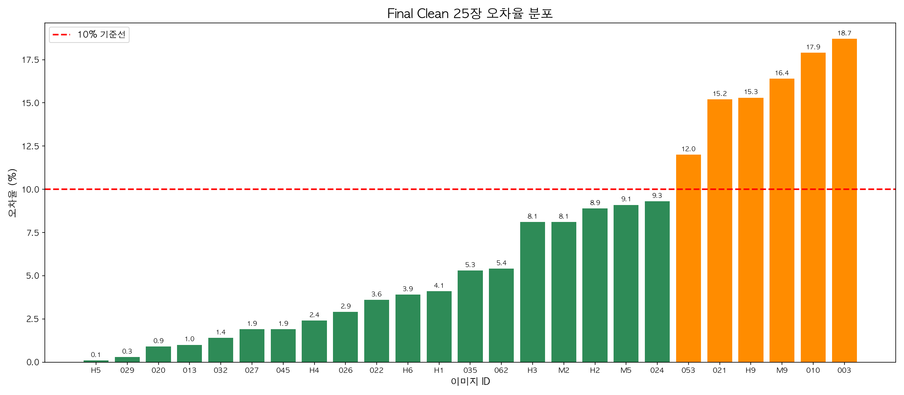
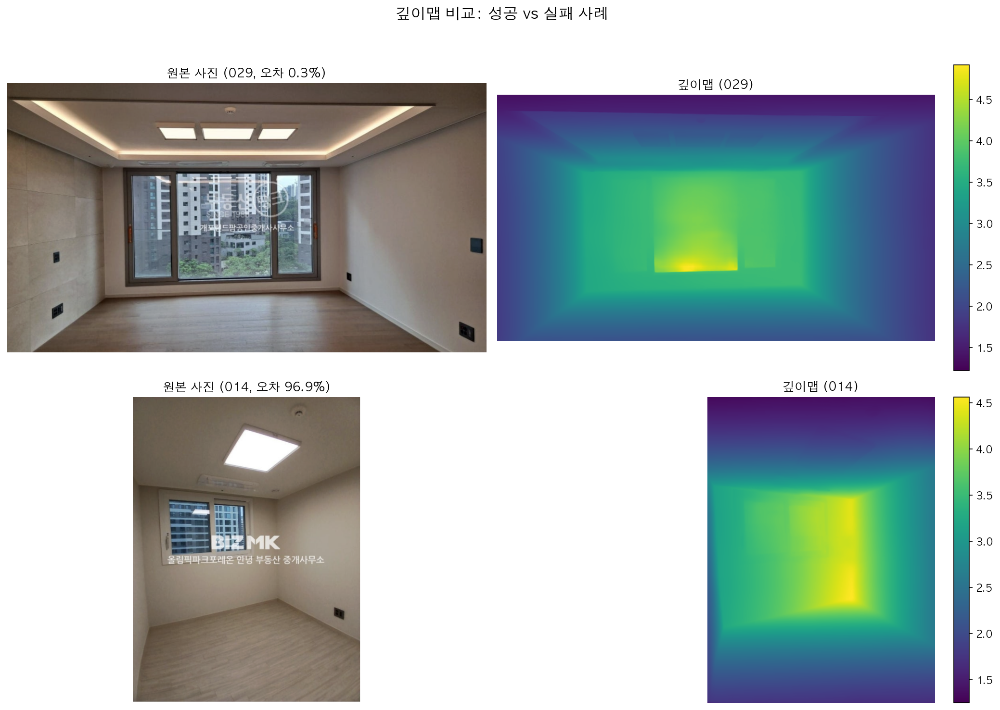

# GeoCalib + Depth Pro 기반 부동산 매물 사진 실내 거리 측정 파이프라인 검증

## 연구 배경 및 목적

부동산 매물 사진은 광각 렌즈로 촬영되어 실제 공간보다 넓어 보이는 문제가 있다. 플랫폼은 업로드 시 EXIF(focal length 등)를 삭제하여 렌즈 정보를 감추고 있다.

**본 연구의 목적**: GeoCalib(ECCV 2024)으로 focal length를 자동 추정하고, Depth Pro(Apple, ICLR 2025)로 depth map을 생성하여, 부동산 사진에서 벽-벽 거리를 자동 측정하는 파이프라인을 구축하고 정확도를 평면도 GT와 비교하여 검증한다.

**관련 연구**:
- Propix (2024, 한국정보기술학회): GeoCalib으로 왜곡 탐지만 수행, 거리 측정 없음. "왜곡률 기준값 도출을 위한 연구가 진행 중"이라고 명시.
- 본 연구는 Propix가 하지 못한 실제 거리 측정 + GT 검증까지 확장.

---

## 파이프라인 구조

```
부동산 사진 → GeoCalib (focal length 추정) → Depth Pro (depth map 생성, focal 입력)
→ 3D 점 복원 → RANSAC 평면 피팅 → 벽-벽 수직 거리 측정 → GT(평면도) 비교
```

**GeoCalib 역할**: EXIF 없이 이미지만으로 focal length 자동 추정 (ECCV 2024, ETH Zurich)
**Depth Pro 역할**: GeoCalib focal을 입력받아 metric depth map 생성 (ICLR 2025, Apple)

---

## 사용 모델의 공식 성능

### Depth Pro 벤치마크 (논문 공식 결과)

Depth Pro는 zero-shot metric depth estimation에서 여러 벤치마크에 걸쳐 **평균 순위 1위 (2.5)**를 달성:

| 모델 | Booster | ETH3D | Middlebury | NuScenes | Sintel | Sun-RGBD | 평균 순위 |
|---|---|---|---|---|---|---|---|
| Metric3D v2 | 39.4 | **87.7** | 29.9 | **82.6** | 38.3 | 75.6 | 3.7 |
| UniDepth | 27.6 | 25.3 | 31.9 | 83.6 | 16.5 | **95.8** | 4.2 |
| ZoeDepth | 21.6 | 34.2 | 53.8 | 28.1 | 7.8 | 85.7 | 5.3 |
| **Depth Pro** | **46.6** | 41.5 | **60.5** | 49.1 | **40.0** | 89.0 | **2.5** |

(delta1: 25% 이내 오차 비율, 높을수록 좋음)

- Depth Pro는 특정 데이터셋에서 1위가 아니더라도, 모든 데이터셋에서 **일관되게 상위권**
- Sun-RGBD (실내 데이터셋)에서 89.0%의 delta1 달성

### Depth Pro의 focal length 추정 성능

| 데이터셋 | UniDepth | SPEC | **Depth Pro** |
|---|---|---|---|
| RAISE | 35.4% | 49.2% | **84.2%** |
| FiveK | 24.8% | 30.2% | **74.2%** |
| SPAQ | 44.2% | 50.0% | **68.4%** |

(25% 이내 오차 비율) → Depth Pro 자체도 focal 추정이 뛰어나지만, 본 연구에서는 GeoCalib의 focal이 광각에서 더 정확함을 확인.

**참고**: Depth Pro 논문은 per-pixel depth 정확도를 평가하며, 벽-벽 거리 측정 같은 point-to-point 거리 정확도는 평가하지 않음. 본 연구가 이 gap을 채움.

---

## 데이터셋

| 구분 | 장수 | 단지 |
|---|---|---|
| 기존 데이터 | 63장 | 올림픽파크포레온, 개포자이프레지던스, 래미안원베일리 |
| 신규 헬리오시티 | 7장 | 헬리오시티 |
| 신규 마포래미안 | 11장 | 마포래미안푸르지오 |
| **총** | **81장** | 5개 단지 |

GT: 네이버 부동산 도면에서 벽 중심선 거리 → 벽 두께 160mm 차감(마감면 기준)

---

## 실험 결과

### 1. 조건별 측정 오차

| 조건 | 장수 | 평균 오차 | 중앙값 | 10%이하 비율 |
|---|---|---|---|---|
| 전체 (유효) | 72장 | 17.3% | 15.1% | 39% |
| both_clear (양쪽벽 보임) | 47장 | 12.0% | 9.9% | 51% |
| one_unclear (한쪽 불명확) | 25장 | 27.3% | 23.0% | 16% |
| **final_clean (최종 양호)** | **25장** | **7.0%** | **5.3%** | **76%** |
| obstacle=yes (장애물 있음) | 20장 | 23.7% | 22.5% | 15% |

- 유효 데이터: 81장 중 failed 9장 제외 = 72장
- failed: RANSAC 실패, 극단적 오차, 또는 특수공간(발코니창고 등)

**핵심 발견**: 조건이 좋은 사진(양쪽 벽 명확, 장애물 없음, 정면 촬영)에서 약 76%가 10% 이하 오차로 측정 가능.



### 2. GeoCalib focal vs Depth Pro 자체 추정

기존 63장 중 유효 데이터 대상 비교 (H/M 신규 데이터는 focal 비교 미실시):

| 조건 | A (GeoCalib) | B (Depth Pro 자체) | A 승률 |
|---|---|---|---|
| 전체 (56장) | 18.5% | 21.1% | 66% |
| 광각 (<500px, 40장) | 19.7% | 23.4% | 70% |
| 일반 (>=500px, 16장) | 15.6% | 15.3% | 56% |

- Depth Pro 자체도 focal 추정 성능이 우수하지만 (논문 기준 RAISE 84.2%), 광각 부동산 사진에서는 GeoCalib이 더 정확
- 일반 화각에서는 두 방법이 비슷한 성능

**핵심 발견**: 광각 사진에서 GeoCalib focal이 Depth Pro 자체 추정보다 3.7%p 낮은 오차, 70% 승률.



### 3. Barrel Distortion 보정 효과 (ER)

ER = D_wide(원본) / D_corrected(GeoCalib 보정)
- 기존 63장 중 이상치(ER>1.5) 및 failed 제외한 유효 데이터 기준

| 지표 | 값 |
|---|---|
| ER 중앙값 | 0.998 |
| ER 평균 | 0.994 |
| ER 범위 | 0.935 ~ 1.038 |

**결론**: ER ≈ 1.0으로, barrel distortion 보정은 Depth Pro의 거리 추정에 유의미한 영향을 주지 않음. 이는 Buquet et al. (2021, CVPR Workshop)의 "보정 시 5% 개선" 결과와 대비되며, 최신 MMDE 모델(Depth Pro)이 barrel distortion에 robust함을 시사.



### 4. final_clean 25장 오차 분포

| 순위 | ID | 오차 |
|---|---|---|
| 1 | H5 | 0.1% |
| 2 | 029 | 0.3% |
| 3 | 020 | 0.9% |
| 4 | 013 | 1.0% |
| 5 | 032 | 1.4% |
| ... | ... | ... |
| 21 | 021 | 15.2% |
| 22 | H9 | 15.3% |
| 23 | M9 | 16.4% |
| 24 | 010 | 17.9% |
| 25 | 003 | 18.7% |

- 19장(76%)이 10% 이하 오차
- 중앙값 5.3%, 범위 0.1%~18.7%



### 5. Depth Map 비교 (성능 좋은 사진 vs 나쁜 사진)



---

## 측정 적합 조건 가이드라인

| 조건 | 필수 여부 | 근거 |
|---|---|---|
| 양쪽 벽이 이미지에 보임 | **필수** | one_unclear 평균 27.3% vs both_clear 12.0% |
| 장애물(가구/아일랜드 등) 없음 | **필수** | 장애물 있으면 평균 23.7% |
| 발코니 유리문이 벽 대신 없음 | **필수** | 유리문 → depth가 바깥으로 빠짐 |
| 정면(가운데) 촬영 | **권장** | 치우치면 가장자리에 벽이 없을 수 있음 |

---

## Depth Pro 내부에서의 focal length 처리

Depth Pro 소스코드 (depth_pro.py, 281~293줄) 확인:

```python
canonical_inverse_depth, fov_deg = self.forward(x)  # focal과 무관
inverse_depth = canonical_inverse_depth * (W / f_px)  # f_px로 스케일링
depth = 1.0 / torch.clamp(inverse_depth, min=1e-4, max=1e4)
```

- `canonical_inverse_depth`는 f_px 입력과 **독립적**으로 계산 (신경망 예측)
- f_px는 **최종 스케일링에만** 사용 → 모델 튜닝이 아닌 변환 계수
- 수학적으로 3D 복원 시 X, Y 좌표에서 f_px는 약분되어 Z(깊이)의 스케일만 결정
- GeoCalib의 정확한 f_px → 정확한 metric depth 변환

---

## 한계 및 향후 과제

1. **동일 조건에서도 오차 편차 큼**: 양호 조건 25장 중에서도 0.1%~18.7% 범위. Depth Pro가 특정 사진에서 부정확한 이유 불명.
2. **표본 크기**: 81장 (양호 25장). 통계적 신뢰를 위해 추가 데이터 수집 필요.
3. **단일 모델**: Depth Pro만 테스트. Metric3D V2, UniDepth V2와 교차 검증 필요.
4. **GT 불확실성**: 벽 두께 보정 -160mm 일괄 적용, 실제 벽 두께는 단지마다 다름 (±40mm).
5. **RANSAC 측정 방법**: 일부 사진에서 RANSAC이 벽이 아닌 평면을 잡는 경우 존재.
6. **거리 측정 벤치마크 부재**: Depth Pro 논문은 per-pixel 깊이 정확도만 평가. 벽-벽 거리 측정 정확도에 대한 공식 벤치마크가 없어 직접 검증이 필요했음.

---

## 결론

1. GeoCalib + Depth Pro 파이프라인으로 부동산 사진에서 벽-벽 거리를 자동 측정할 수 있음.
2. 양호 조건에서 **약 76%의 사진이 10% 이하 오차** (중앙값 5.3%).
3. Depth Pro는 공식 벤치마크에서 zero-shot metric depth 평균 순위 1위(2.5)이며, GeoCalib focal을 결합하면 **광각 사진에서 추가 3.7%p 개선** (승률 70%).
4. Barrel distortion 보정은 **불필요** (ER ≈ 1.0).
5. Propix(2024)의 미해결 과제인 정량적 측정을 본 파이프라인으로 부분적으로 해결.
